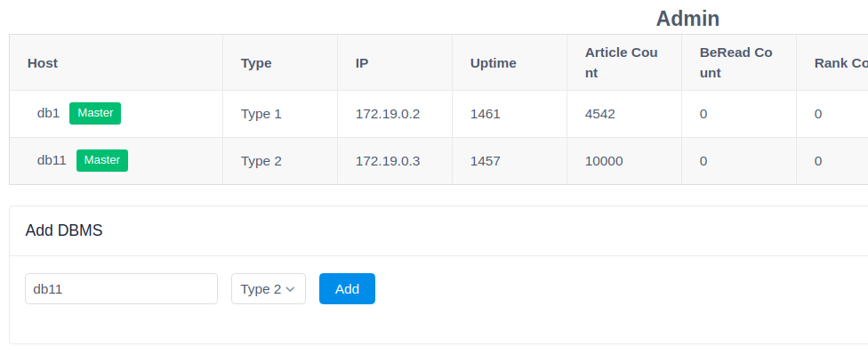
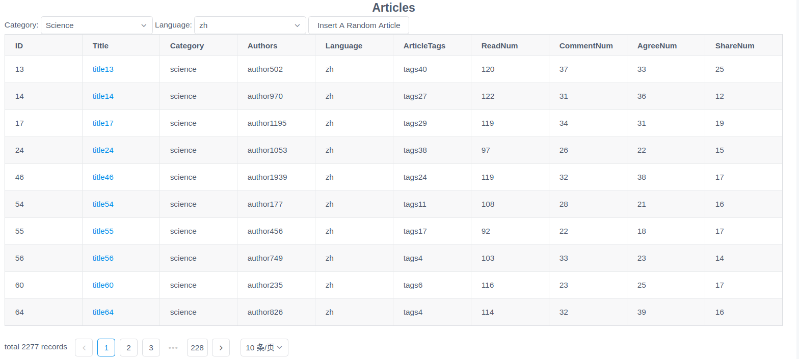
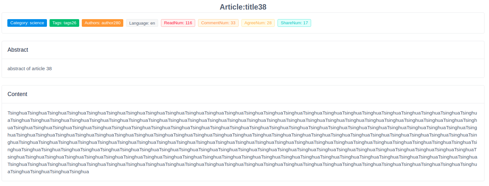
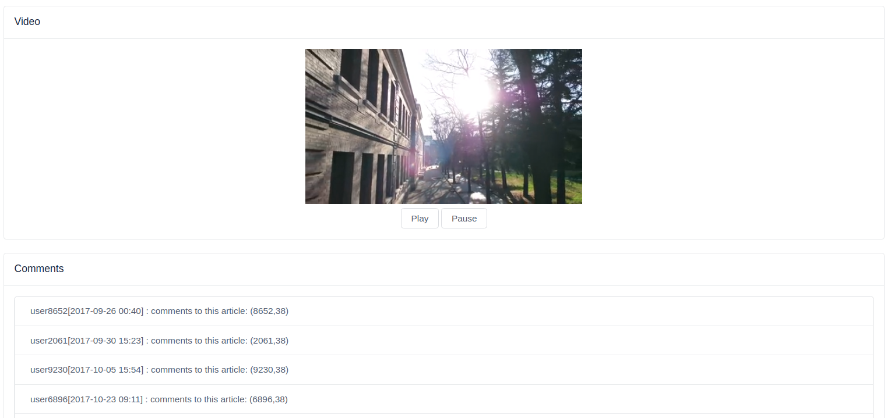

### System Requirements

* Ubuntu (Ubuntu 18.04 recommended)

### Install Node & Docker

1. Install `node`
```sh
sudo apt install npm
sudo npm i n -g
sudo n lts
```

2. Install `docker` & `docker-compose`
```sh
sudo apt docker.io docker-compose
```

### Build Demo

First of all, you should change current path to demo project.
```sh
cd /path/to/demo/project
```

1. Build docker images
```sh
sudo docker-compose build
```

2. Install demo project dependencies
```sh
npm i
```

3. Build frontend
```sh
npm run build
```

### Initialize DBMS Clusters

1. Start dbms docker containers
```sh
sudo docker-compose up -d db1 db2 db3 db4 db5 db11 db12 db13 db14 db15
```
`db1 db2 db3 db4 db5` are first type DBMS, and `db11 db12 db13 db14 db15` are second type DBMS.

2. Initialize dbms
```sh
sudo docker-compose exec db1 mongo --eval "rs.initiate()"
sudo docker-compose exec db11 mongo --eval "rs.initiate()"
```

### Start demo website

Now we can start our website using following command:
```sh
sudo docker-compose up -d web
```

And then we can open `http://localhost:8800/` in our browser, we can see there are welcome page, articles page, users page, popular page and admin page, but erveything is empty because we have not imported data.

**If you are the first time open whe website, it's recommended that add 2 DBMS in admin page (`http://localhost:8800/admin`) using following instructions**:
1. Open admin page (`http://localhost:8800/admin`) in browser
2. Next you can see the `Add DBMS` panel in admin page
3. Set `DB HOST` as `db1` (the text input ), and set `DB TYPE` as `Type 1` (the selection input), and click `Add` button
4. Set `DB HOST` as `db11` (the text input ), and set `DB TYPE` as `Type 2` (the selection input), and click `Add` button

If you see the following admin page, the your setting is all right.


### Build & Import data

1. Generate data
```sh
cd 3-sized-db-generation
python3 genTable_mongoDB10G.py
```

2. Load data to dbms
**Make sure you have add 2 DBMS in the admin page before importing data.**
```sh
sudo docker-compose run --rm web node src/load.js
```

3. Generate popular rank
```sh
sudo docker-compose run --rm web node src/buildrank.js
```

### [Optional]Add More DBMS

Open admin page `http://localhost:8800/admin`,  use the `Add DBMS` panel to add more dbms, but there is something you need to know:
1. Do not add same dbms more than once
2. `db1, db2, db3, db4, db5` can only be added as `Type 1` DBMS
3. `db11, db12, db13, db14, db15` can only be added as `Type 2` DBMS

### Demo Website

If you have done all the things above, then you will be able to use all the functions. Here are some images about our website.





